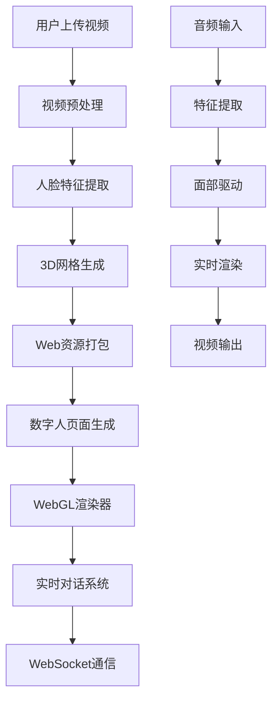

# 数字人训练平台 - Web服务集成指南

## 📖 项目概述

这是一个轻量化的数字人训练和推理平台，支持通过简单的视频输入训练个性化数字人，并提供实时对话功能。

### 核心特性
- **🚀 轻量化**: 推理算力仅39 MFlops，支持所有设备运行
- **📱 跨平台**: 支持Web、移动端、小程序等多平台
- **🎯 无需训练**: 开箱即用，无需复杂的训练过程
- **🔧 API化**: 提供完整的RESTful API接口

## 🏗️ 架构设计

### 系统架构图


### 技术栈
- **后端**: Python + FastAPI + PyTorch
- **前端**: JavaScript + WebGL + WebSocket
- **AI模型**: DINet_mini (面部驱动) + Audio2Feature (音频处理)
- **部署**: Docker + Nginx

## 🚀 快速开始

### 1. 环境准备

#### 使用Docker部署 (推荐)
```bash
# 克隆项目
git clone <your-repo>
cd 2dHuman

# 下载预训练模型
# 请从 https://pan.baidu.com/s/1jH3WrIAfwI3U5awtnt9KPQ?pwd=ynd7 下载checkpoint文件

# 启动服务
docker-compose up -d
```

#### 手动安装
```bash
# 创建虚拟环境
conda create -n digital-human python=3.11
conda activate digital-human

# 安装依赖
pip install -r requirements_api.txt
pip install torch --index-url https://download.pytorch.org/whl/cu124

# 启动API服务
python api_server.py
```

### 2. API接口说明

#### 训练数字人
```http
POST /train
Content-Type: multipart/form-data

video: <video_file>
config: {
    "name": "小卿",
    "personality": "温柔、体贴、善解人意",
    "voice_type": "女性 - 温柔女声",
    "enable_vision": true,
    "system_prompt": "自定义提示词"
}
```

响应:
```json
{
    "success": true,
    "message": "数字人训练完成",
    "digital_human_id": "uuid",
    "web_url": "/digital-human/uuid",
    "assets_info": {...}
}
```

#### 获取数字人列表
```http
GET /list
```

#### 推理生成视频
```http
POST /inference
Content-Type: multipart/form-data

digital_human_id: <uuid>
audio_file: <audio_file>
```

### 3. 集成示例

#### Python客户端
```python
from integration_examples import DigitalHumanClient

client = DigitalHumanClient("http://localhost:8000")

# 训练数字人
result = client.train_digital_human(
    video_path="path/to/video.mp4",
    name="小美",
    personality="活泼开朗",
    voice_type="女性 - 甜美女声"
)

print(f"数字人ID: {result['digital_human_id']}")
print(f"访问链接: {result['web_url']}")
```

#### JavaScript调用
```javascript
// 训练数字人
async function trainDigitalHuman(videoFile, config) {
    const formData = new FormData();
    formData.append('video', videoFile);
    formData.append('config', JSON.stringify(config));
    
    const response = await fetch('/api/train', {
        method: 'POST',
        body: formData
    });
    
    return await response.json();
}

// 使用示例
const config = {
    name: "小卿",
    personality: "温柔可爱",
    voice_type: "女性 - 温柔女声",
    enable_vision: true
};

const result = await trainDigitalHuman(videoFile, config);
console.log('数字人训练完成:', result);
```

## 🔧 高级配置

### 1. 自定义声音类型

支持的声音类型包括：
- **女性声音**: 温柔女声、台湾女友、甜美女声等 50+ 种
- **男性声音**: 阳光青年、儒雅公子、磁性男嗓等 80+ 种

### 2. 视觉模型配置

```python
# 启用视觉对话模型 - 支持实时相机画面识别
config = {
    "enable_vision": True,  # 多模态交互
    # 适用场景：物体识别、场景描述、文字提取
}

# 普通对话模型 - 纯语音/文本交互
config = {
    "enable_vision": False,  # 高效响应
    # 适用场景：咨询、写作辅助、客服
}
```

### 3. 自定义系统提示词

```python
custom_prompt = """
基本信息：
名字：小智
职业：AI助手
专长：编程、技术咨询

性格特点：
- 专业严谨，逻辑清晰
- 耐心细致，善于解释复杂概念

对话风格：
- 提供具体的解决方案
- 回复简洁明了
- 字数控制在50字以内
"""

result = client.train_digital_human(
    video_path="video.mp4",
    system_prompt=custom_prompt
)
```

## 🌐 部署方案

### 方案一：单机部署
```yaml
# docker-compose.yml
version: '3.8'
services:
  digital-human-api:
    build: .
    ports:
      - "8000:8000"
    volumes:
      - ./checkpoint:/app/checkpoint:ro
      - ./website:/app/website
```

### 方案二：分布式部署
```yaml
# 负载均衡 + 多实例
version: '3.8'
services:
  nginx:
    image: nginx:alpine
    ports:
      - "80:80"
    
  api-1:
    build: .
    environment:
      - INSTANCE_ID=1
      
  api-2:
    build: .
    environment:
      - INSTANCE_ID=2
```

### 方案三：云原生部署
```yaml
# Kubernetes部署
apiVersion: apps/v1
kind: Deployment
metadata:
  name: digital-human-api
spec:
  replicas: 3
  selector:
    matchLabels:
      app: digital-human-api
  template:
    metadata:
      labels:
        app: digital-human-api
    spec:
      containers:
      - name: api
        image: digital-human-api:latest
        ports:
        - containerPort: 8000
```

## 📊 性能指标

| 指标 | 数值 | 说明 |
|------|------|------|
| 推理算力 | 39 MFlops | 单帧计算量 |
| 资源大小 | <3MB | 压缩后网页资源 |
| 响应时间 | <500ms | API响应时间 |
| 并发支持 | 100+ | 同时在线用户 |
| 设备支持 | 全平台 | 包括手机浏览器 |

## 🔍 故障排查

### 常见问题

1. **训练失败**: 检查视频格式和人脸检测
2. **推理慢**: 确认模型文件完整性
3. **WebSocket连接失败**: 检查网络和防火墙设置
4. **内存不足**: 调整Docker内存限制

### 日志查看
```bash
# API服务日志
docker-compose logs -f digital-human-api

# Nginx日志
docker-compose logs -f nginx
```

## 🛡️ 安全建议

1. **API访问控制**: 添加认证和授权机制
2. **文件上传限制**: 限制文件大小和类型
3. **资源清理**: 定期清理临时文件
4. **HTTPS部署**: 生产环境使用HTTPS

## 📝 更新日志

- **v1.0.0**: 基础API功能实现
- **v1.1.0**: 添加批量训练支持
- **v1.2.0**: 优化性能，支持Docker部署
- **v1.3.0**: 添加视觉模型支持

## 🤝 贡献指南

欢迎提交Issue和Pull Request来改进项目！

## 📄 许可证

MIT License - 详见 [LICENSE](LICENSE) 文件

## 📞 联系方式

- 技术支持: 微信 lkz4251
- 项目地址: [GitHub](https://github.com/your-repo)
- 在线文档: [文档站点](https://your-docs-site.com) 